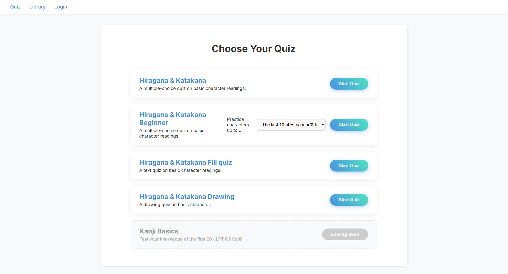

# Japanese Quiz App 🇯🇵


**Japanese Quiz** is a personalized web application designed to accelerate language acquisition through active recall and unlimited practice. Built with **Laravel**, this project allows users to practice Japanese vocabulary and writing through various interactive quiz modes.




## 💡 The Inspiration: "Learning by Building"

> *"I believe the best way to learn is through trial and error."*

Originally developed as a personal tool to fill gaps in my own Japanese studies, this project addresses the limitations of standard language apps. I needed a platform where I could:
1.  **Drill specific weak points** without restrictions.
2.  **Customize the content** (Vocab/Kanji) based on what I was actually learning.
3.  **Practice writing** (Drawing mode) directly in the browser.

This project represents my journey as a **Self-Learner**, combining my interest in programming with my passion for languages.

## 🌟 Key Features

* **🎨 Drawing Quiz:** A unique feature allowing users to practice writing Hiragana, Katakana, or Kanji directly on the screen (Canvas integration).
* **📝 Multiple Quiz Modes:**
    * **Multiple Choice:** Rapid-fire vocabulary testing.
    * **Text Input:** Test spelling and precise recall.
    * **Drawing:** Test stroke order and character memory.
* **📚 Custom Library:** Users can manage their own database of Words and Characters (CRUD functionality via `LibraryController`).
* **🗣️ Interactive Feedback:** Audio cues (Correct/Incorrect sounds) to reinforce learning.
* **🔰 Proficiency Levels:** Organized content for Beginner (Hiragana/Katakana) to Intermediate levels.

## 🛠️ Tech Stack

* **Framework:** Laravel 11
* **Frontend:** Blade Templates, Custom JavaScript (for Drawing/Canvas logic), CSS
* **Database:** MySQL
* **Assets:** Audio integration for quiz feedback

## 🚀 Installation & Setup

Since the database migrations and seeders are already prepared, setting up the project is straightforward.

1.  **Clone the Repository**
    ```bash
    git clone [https://github.com/rinriku69/japanese-quiz.git](https://github.com/rinriku69/japanese-quiz.git)
    cd japanese-quiz
    ```

2.  **Install PHP Dependencies**
    ```bash
    composer install
    ```

3.  **Install Frontend Dependencies**
    ```bash
    npm install
    npm run build
    ```

4.  **Configure Environment**
    * Copy the `.env.example` file:
        ```bash
        cp .env.example .env
        ```
    * Edit `.env` to match your database credentials:
        ```env
        DB_CONNECTION=mysql
        DB_HOST=127.0.0.1
        DB_PORT=3306
        DB_DATABASE=japanese_quiz
        DB_USERNAME=root
        DB_PASSWORD=
        ```

5.  **Generate App Key**
    ```bash
    php artisan key:generate
    ```

6.  **Database Setup (Important)**
    * Run migrations and seeders to populate the database with initial Japanese characters and vocabulary:
    ```bash
    php artisan migrate --seed
    ```

7.  **Run the Server**
    ```bash
    php artisan serve
    ```

8.  **Start Learning**
    * Visit `http://localhost:8000` in your browser.

## 📂 Project Structure Highlights

* `app/Http/Controllers/QuizController.php`: Handles the logic for generating random quizzes and checking answers.
* `app/Http/Controllers/LibraryController.php`: Manages the user's vocabulary list.
* `resources/views/quiz/`: Contains the blade files for different quiz types (drawing, choice, text).
* `public/js/component.js`: Contains the JavaScript logic for the drawing canvas and interactivity.

## 🤝 Contributing

This is a personal portfolio project, but suggestions are welcome!
1.  Fork the repo.
2.  Create a feature branch.
3.  Submit a Pull Request.

---
**Developed by Rinriku69**
